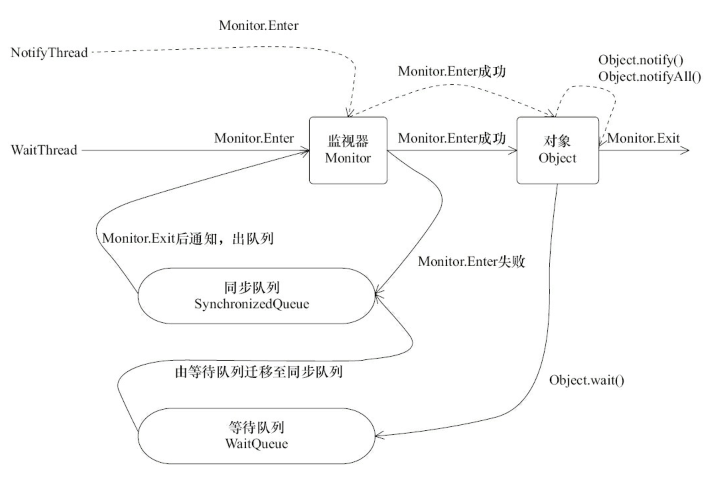

WaitThread首先获得对象锁，然后调用对象的wait()方法，从而放弃了锁并进入了对象的等待队列WaitQueue中，进入等待状态。由于WaitThread释放了对象的锁，NotifyThread随后获取了对象的锁，并调用对象的Notify()方法，将WaitThread从WaitQueue移到SynchronizedQueue中，此时WaitThread处于阻塞状态。NotifyThread释放锁之后，WaitThread再次获取到锁并从wait()方法返回执行。

### 等待/通知的经典范例
范式分为两部分，分为等待方（消费者）和通知方（生产者）
#### 等待方遵循如下原则
+ 获取对象的锁
+ 如果条件不满足，那么调用对象的wait方法，被通知后仍要检查条件
+ 条件满足则执行对应的逻辑

对应的伪代码如下

```
synchronized(对象){
	while(条件不满足){
		对象.wait();
	}
	对应的处理逻辑
}
```

#### 通知方遵循如下原则
+ 获得对象的锁
+ 改变条件
+ 通知所有等待在对象的线程

对应的伪代码如下

```
synchronized(对象){
	改变条件
	对象.notifyAll();
}
```
